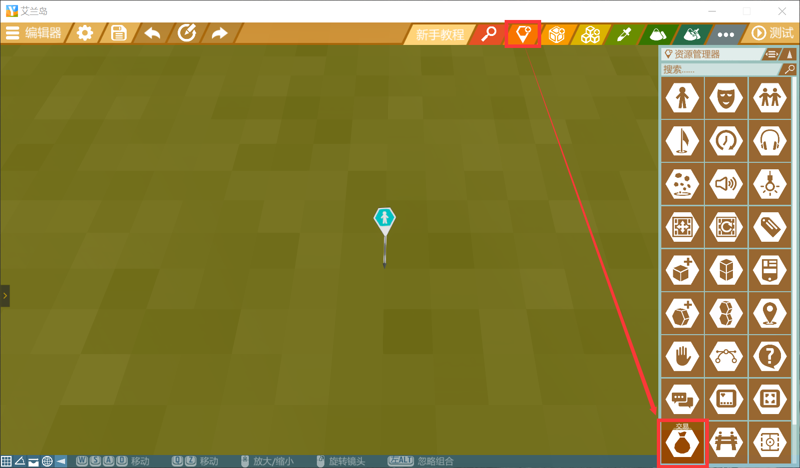
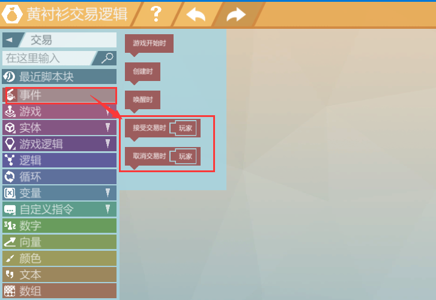
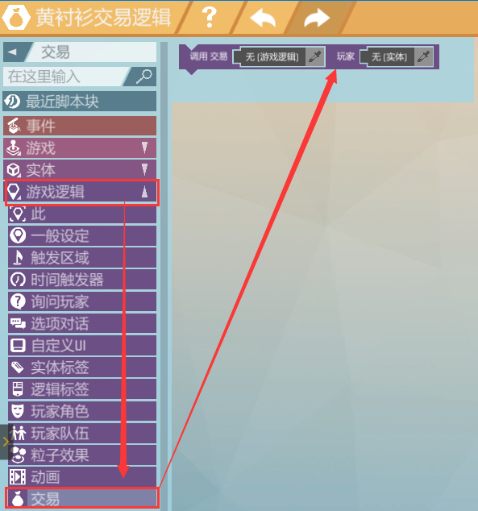
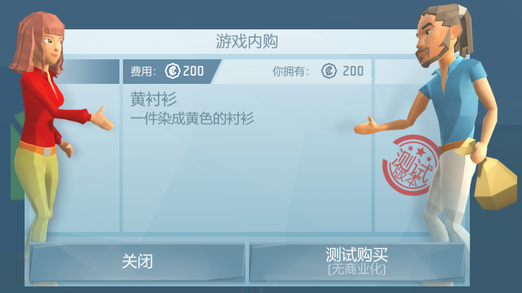
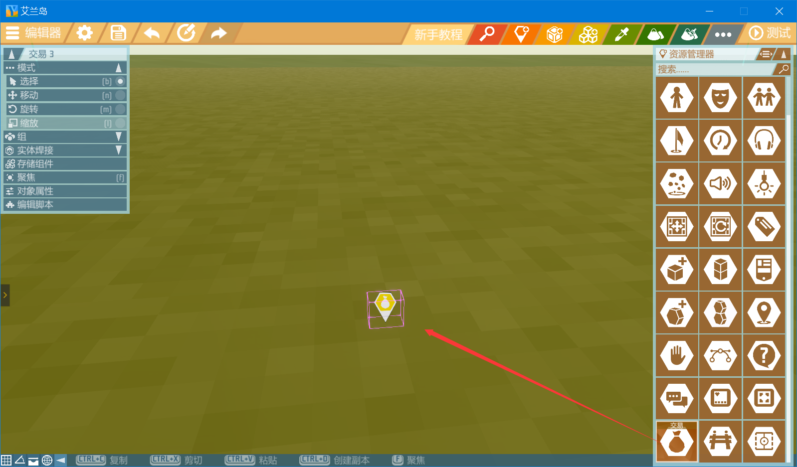
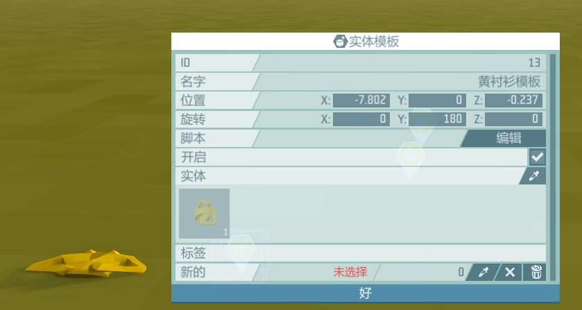

# 艾兰岛商业集成

[TOC]

## 交易逻辑

艾兰岛从0.14版本开始在**编辑器->添加游戏逻辑**面板中新增了 **交易** 逻辑，通过 **交易** 逻辑，开发者可以快速的为游戏集成商业化内容。

**交易逻辑** 目前支持以下几种功能：

- 最重要的写在第一个：一个**交易逻辑**只支持一个商品的交易，进一步解释就是，在游戏里如果卖1个商品，对应要1个**交易逻辑**，如果要卖100个商品，就要拖入100个**交易逻辑 **
- 支持设定商品的 **名称** 以及 **商品详情**，**名称** 在标题处设置，**商品详情**在描述处填写
- 支持设定商品的 **单价**

* 在脚本编辑的**事件** 中，针对每个商品交易，提供2个事件：**接受交易时**，**取消交易时** 

同时，在**游戏逻辑--> 交易** 中，提供在其他逻辑中调用**交易逻辑**的指令

再次，提供一个交易过程中的默认交易界面，如下图：

## 使用方式

1. 从**编辑器->添加游戏逻辑**面板向场景中拖入一个**交易**逻辑

   

2. 双击**交易**逻辑，打开**对象属性**面板

   

3. 制作一件准备出售的商品，这件商品可以是利用游戏原本素材二次创作的，只要把商品实体模板化即可。

   

4. 打开一开始拖入场景的**交易**逻辑的**编辑脚本**，编写**接受交易时**与**取消交易时** 二个事件对应的逻辑

   

   * 接受交易时，即购买者发起购买请求时发生，开发者编写对应事件的响应逻辑，响应逻辑需要包括以下2个内容：
     * 可以对来购买的玩家进行各种条件判断；（唯一不需要开发者进行判断的就是购买者身上钱够不够，这由游戏服务器自己判断）
     * 如果符合条件，发放你的商品；比如上图例子就是给购买者背包发放一件”黄衬衫“
   * 取消交易时，即购买者关闭交易时或者游戏服务器判断购买者钱不够时发生，开发者编写对应取消交易时的响应逻辑。

5. 调用**交易逻辑** ，让购买者能够发起购买请求，下图实例步骤是：

   * 给场景中的黄衬衫对象属性面板，勾选**使用自定义交互**，取消原来**使用默认交互**的勾选

   * 打开黄衬衫实体的脚本编辑，在事件中，增加互动时事件，调用”黄衬衫交易逻辑“

     

     

## 效果展示

1. 给实体增加自定义交互，开启购买流程

   <iframe frameborder="0" src="https://v.qq.com/txp/iframe/player.html?vid=r0920s1uj0p" allowFullScreen="true" height=600></iframe>

2. 结合0.14版自定义UI与按键监听，制作商城界面，进行购买

   <iframe frameborder="0" src="https://v.qq.com/txp/iframe/player.html?vid=n0920ip17fp" allowFullScreen="true" height=600></iframe>

