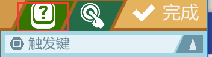
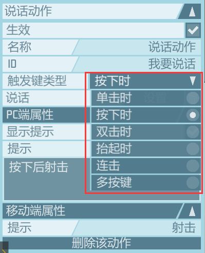
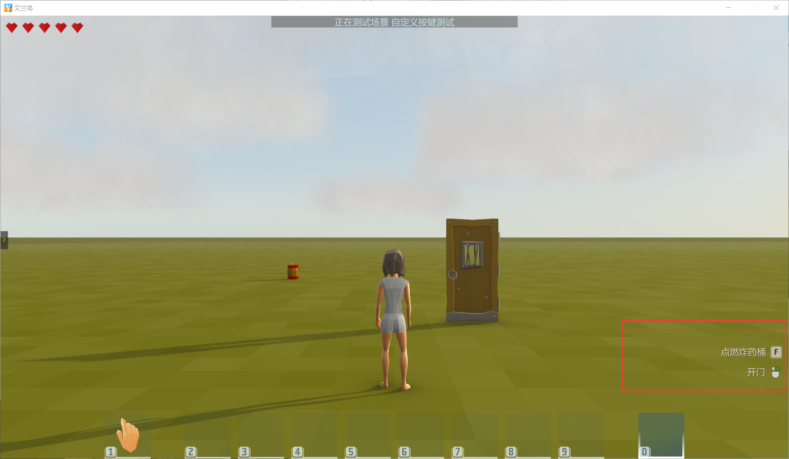

[TOC]

# 自定义按键监听

游戏，从本质上来说，是一个电脑程序，玩家玩游戏，就是一个玩家与游戏交互的过程；我们都知道交互是双向的作用，游戏中的信息交互也是如此，由两部分组成：

* 主动性行为：玩家向游戏输入信息指令，告诉系统如何运行，输入方式主要是**键盘**、**鼠标**，移动端是屏幕**触屏**
* 被动性行为：系统向玩家发送信息，反馈玩家操作之后游戏的状态；

玩家往往希望通过不同的操作输入，来控制，改变游戏，增加体验感，所以传统的游戏开发，往往会向开发者提供各类自定义按键监听功能，使得开发者可以制作处交互体验完全不同的游戏。因此，一定程度上说，操作决定了游戏性，甚至决定了开发者的游戏类型。

从0.14版本开始，《艾兰岛》编辑器增加了**自定义按键监听** 功能。

## 自定以按键监听功能说明

1. 支持所有键盘按键监听；
2. 支持鼠标除滚轮滚动外的所有按键监听（包括多按键鼠标）；
3. 支持一个按键配置多个动作
4. 支持移动端触屏配置；
5. 支持覆盖原来的键盘按键交互（按鼠标左键，人物攻击动作无法完全覆盖）

自定义按键监听核心记住：

> **按键和动作肯定是成对出现：按键 绑定 动作，按键 触发 动作；**
>
> **要用事件监听器监听按键动作**

## 效果演示

<iframe frameborder="0" src="https://v.qq.com/txp/iframe/player.html?vid=i0920t9x81v" allowFullScreen="true" height=600></iframe>

## 使用方法

### 界面说明

1. 从左上角**编辑器-->游戏设置-->自定义控制** 打开 **自定义控制** 面板

   

2. **触发键**界面

   在触发界面，做二件事：

   - 设置监听的按键
   - 对监听的按键设置名称，以便在动作界面配置时方便调用

   

3. **动作**界面

   在动作界面，也是做二件事：

   - 新建一个动作，给动作定义名称-->方便右侧搜索，定义ID-->作为**动作ID**传给**事件监听器** 用于判断接受到的动作

   

### 设置需要监听的按键

1. 确认在右上角选中**触发键**页签

   

2. 点击右侧加号，新增触发键

   

3. 在左侧面板中，修改名称

4. 点击左侧面板，PC端属性-->设置按钮；

5. 屏幕中弹出一个小的UI时，直接在按下键盘上要监听的按键，或直接按下需要监听的鼠标键

6. 再次点击右侧选中的触发键，刷新对应按键

知识点：

1. 如果设置按键设置错误，在右侧可以选中需要修改的触发键，再次设置；
2. 如果不需要某个创建的触发键，可以鼠标左键选中它，然后按DELETE删除；

按键配置演示

### 设置按键对应的事件

1. 确认右上角选中**动作**页签

   

2. 点击右侧加号，新增动作

3. 选中新增的动作，在左侧面板修改动作对应属性：

   * 名称：修改后，方便在右侧动作列表里搜索

   * ID：**此处修改的值用于之后事件监听器中调用**

   * 触发键类型：设定自定义按键在什么状态下能够触发（被监听到）动作。

     

   * 点击设置，给动作选择对应的按键

     
     
   * PC端属性，设置是否显示提示以及提示文字内容，如果勾选与设置了提示，在运行游戏后，游戏右下会显示**按键提示**
   
     

知识点：

1. 一个按键可以绑定多个动作，只需在**设置**阶段，多个动作都选择同样的按键；
2. 在设置按键绑定时，选择默认中的按键，会覆盖掉按键原来的动作（鼠标左键人物攻击动作不能覆盖）

动作配置演示

### 事件监听器监听按键事件

这里是教大家如何如何监听自定义按键按下后的动作，以及监听到动作后，调用自己的逻辑

1. 拖入**事件监听器**，打开对象属性面板，配置如下：

   * 监听：玩家动作
   * 发起者：根据需要设定
   * 事件：**进行自定义按键动作时**

   

2. 打开**事件监听器** 编辑脚本

   * 事件--> 拖入 **进行自定义按键动作时**
   * 根据之间动作**ID**,判断按键按下时触发那个动作；
   * 在对应判断下，写入自己的逻辑脚本

   

